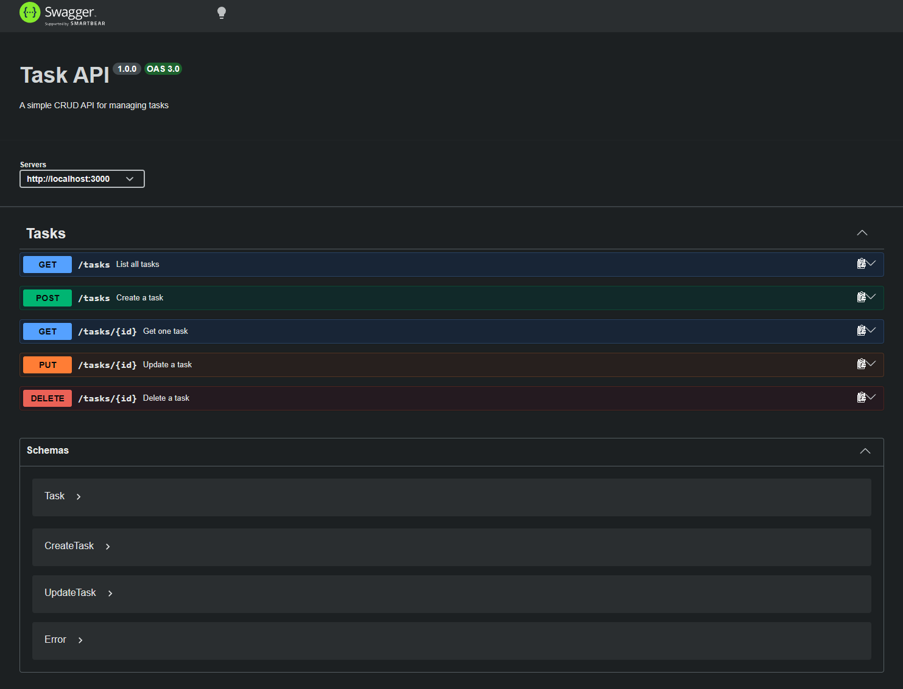

# Task API

A small REST API for creating, reading, updating, and deleting tasks. It uses Express, stores tasks in memory, and provides interactive OpenAPI documentation through Swagger UI.

## Install and run

With Node.js and npm installed, run this command from the project directory:

```powershell
npm install; node index.js
```

The API runs at `http://localhost:3000`, and Swagger UI is available at `http://localhost:3000/docs`.

Tasks are stored in memory, so changes are reset when the server restarts.

## Endpoints

| Method | Endpoint | Description | Success | Errors |
| --- | --- | --- | --- | --- |
| `GET` | `/` | Show API name, version, and task endpoint | `200` | — |
| `GET` | `/health` | Check whether the API is running | `200` | — |
| `GET` | `/tasks` | List all tasks | `200` | — |
| `POST` | `/tasks` | Create a task from a JSON `title` | `201` | `400` |
| `GET` | `/tasks/:id` | Get one task by ID | `200` | `404` |
| `PUT` | `/tasks/:id` | Update a task's `title` and/or `done` value | `200` | `400`, `404` |
| `DELETE` | `/tasks/:id` | Delete a task | `204` | `404` |
| `GET` | `/docs` | Open the interactive Swagger UI | `200` | — |

## Example response

```text
PS> curl.exe -s -i http://localhost:3000/health
HTTP/1.1 200 OK
X-Powered-By: Express
Content-Type: application/json; charset=utf-8
Content-Length: 15
ETag: W/"f-v/Y1JusChTxrQUzPtNAKycooOTA"
Date: Thu, 10 Sep 2026 14:41:57 GMT
Connection: keep-alive
Keep-Alive: timeout=5

{"status":"OK"}
```

## Swagger UI

Swagger UI documents all task endpoints and lets you send requests from the browser.


